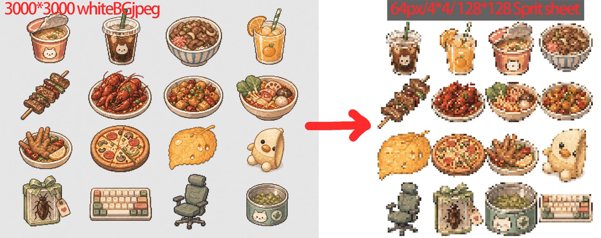
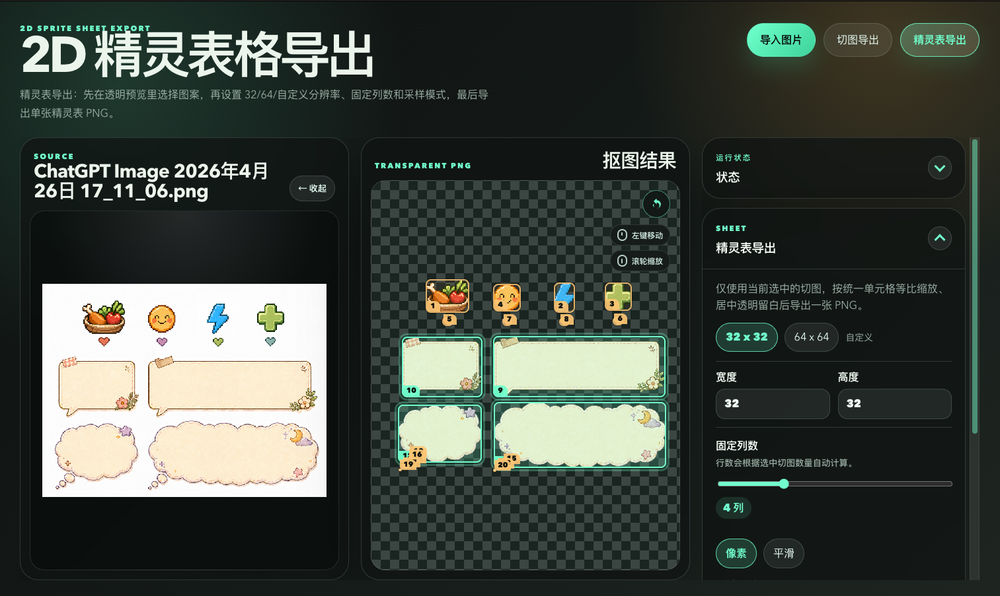

# 2D Sprite Sheet Export

A macOS-oriented tool for 2D sprite background removal, slicing, and sprite sheet export. 

The current main workflow is: import an image, use a “edge-connected background selection” algorithm similar to Photoshop’s magic wand to make the background transparent, then select patterns on the transparent result and export either as “slice export” or “sprite sheet export” in PNG format.

Original image:



## Current Main Workflow

- Import `PNG / JPG / WEBP`
- Automatically sample background colors from the four edges of the image
- Start flood fill from edge seeds, removing only background connected to the edges
- Reduce alpha of semi-background edge pixels adjacent to the background to minimize white fringes
- Optionally shrink the visible pattern’s outer contour inward by 0–4 pixels
- Preview the original image and the transparent PNG result
- Automatically detect separated patterns on the transparent result, with click and box selection support
- Export selected patterns individually as transparent PNGs
- Export selected patterns as a single sprite sheet using `32x32 / 64x64 / custom` grid cells



## Parameter Description

- `Tolerance`: Allowed color difference for the background. Lower for pure white backgrounds; higher for near-white or slightly compressed noisy backgrounds.
- `Edge Softening`: Reduces alpha of semi-background pixels adjacent to the background to alleviate white fringes.
- `Edge Inset`: Applies alpha erosion to foreground pixels next to transparent areas. Default is 1 pixel, suitable for trimming outer white edges; set to 0 if fine lines are lost.
- `Edge Sampling Width`: Number of pixels sampled inward from the image edge to estimate the background.
- `Background Color Count`: Maximum number of clustered background colors. Default is 3, suitable for slight color variations along edges.
- `Sprite Cell Size`: Default `32x32`, can also choose `64x64` or custom dimensions.
- `Fixed Column Count`: Default is 4 columns, rows are calculated automatically.
- `Sampling Mode`: `Pixel` uses nearest neighbor; `Smooth` uses bicubic. Both preserve aspect ratio and center with transparent padding.

## Suitable Assets

Best suited for:

- Pixel assets with white or near-white backgrounds
- Characters/objects with solid color backgrounds
- Assets where the background is connected to the image edges
- Pixel characters with black outlines, even if the interior contains white clothing or light-colored objects

Not suitable for:

- Complex photographic backgrounds
- Images where the background is not connected to the edges
- Assets requiring multiple manual sampling points
- Illustrations requiring semantic AI background removal

## Local Development

### Environment

- Node.js 24+
- npm 11+

### Install Dependencies

```bash
npm install
```

### Start Development Mode

```bash
npm run dev
```

### Run Tests

```bash
npm test
```

### Build

```bash
npm run build
```

### Package macOS App

```bash
npm run package
```

The packaged output will appear in the `release/` directory. At this stage, signing, notarization, and DMG are not included by default.

## Next Steps

- Add new sprites to existing sprite sheets and modify sprite arrangement order
- Add click sampling and add/remove selection
- Add pixel-level comparison/zoom inspection for transparent results
- Further refine semi-transparent edge strategies to reduce stubborn white fringes
